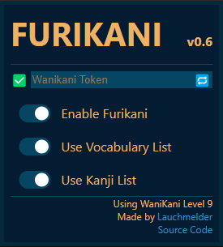

# FuriKani

This is a chrome extension that automatically removes furikani from websites based on your WaniKani level

---

## Installation
[Download it from the Chrome Web Store](https://chrome.google.com/webstore/detail/furikani/lbjenjfljjnlkbdfbgmgcnkfnddaeccl)

---

## How to use
Click the extension icon in your extension bar and enter a WaniKani API Token into the field, and click the checkmark on the right. This will set the token and download the necessary data from WaniKani. If you don't know where your token is, read the following section.

You are presented with the following dashboard

The extension uses your vocabulary and kanji list from WaniKani to decide if it needs to remove a furigana. You can toggle the usage of either list (or both lists). The Kanji list is basically a catch-all for words that aren't *just* made up of kanji (for example verbs, adjectives), so it might remove the furigana of vocabulary you don't yet know based on the kanji. If that bothers you, disable the "Use Kanji List" option.

---

## Where is my WaniKani API token?
You can create a token by logging into WaniKani, clicking your profile icon and navigating to Settings > API Tokens.
Here you click "Generate a new token" and give it a name.

**Do not select any of the checkboxes on this page**

The extension will still work if you do, but it poses a security risk. Depending on which checkboxes you select, people who have your token can modify your WaniKani reviews. **If you don't select any checkbox a read-only token will be created**.

Your API token will not be stored externally. After entering it into the extension it will be stored locally in your browser and will no be visible anywhere.

---

## What does it do *exactly*?
The extension downloads a list of vocabulary and kanji from WaniKani depending on your level. It will fetch all subjects that are *below* your user level. So if you are level 4, then it will download the subjects for levels 1, 2 and 3.

Whenever you load a webpage it will grab all `<ruby>` tags. These are the ones responsible for displaing furigana. It extracts the kanji in the tag and if it can find the word in its internal list, it will add a custom class to the furigana, which is styled to make it invisble.

The cached data is synced everytime you start your browser (in a non-bandwidth-demanding way, keep reading)

---

## Complying with WaniKani API best practices
In order to not send needlessly many requests to the WaniKani API, all data is cached locally. The only scenario where requests are made is when you start your browser or manually request a sync.

When a sync is performed, the extension will fetch user data from the API and do two things:
 * Check if the users level is within the users max allowed level. This is to respect WaniKani subscription restrictions.
 * Check if the users level is different from the locally stored level

If any of the two conditions above are not met, then the sync ends here; no further requests are made.

If both conditions are met, then the extension will request the missing data from WaniKani in case of a level-up. However if the user reset his level, then the data is re-downloaded and re-cached completely.

In short: heavy, bandwidth-extensive requests are only made when the user leveled up or down.

---

## Does this extension collect data?
No. The only web requests made by this extensions are the ones to the WaniKani API. Everything is stored locally on your machine. No data is sent anywhere else.

---

## Miscellaneous
Any help with making the extension work or look better is greatly appreciated. I'm a programmer, not a web designer but I think I did a pretty good job on the extension.
This is also my first web extension and my first proper JavaScipt project. *Please* submit issues and pull requests to make the extension work better.

The extension is licensed under GPL3, meaning that you can download, use and modify the extension however you want. You can also redistribute this extension with any modifications you made to it.
